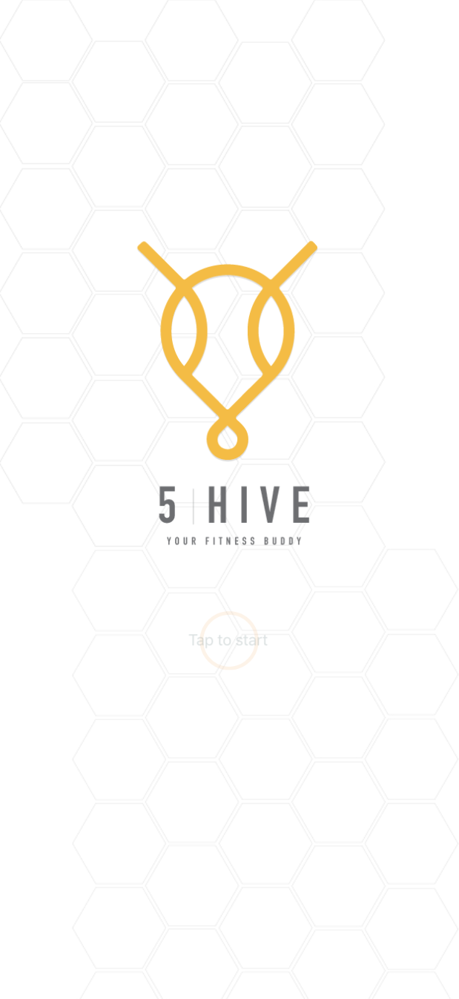
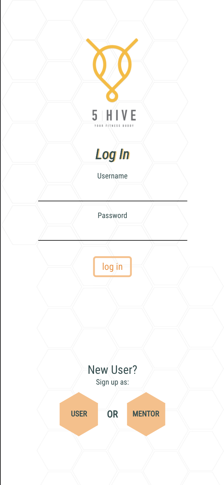
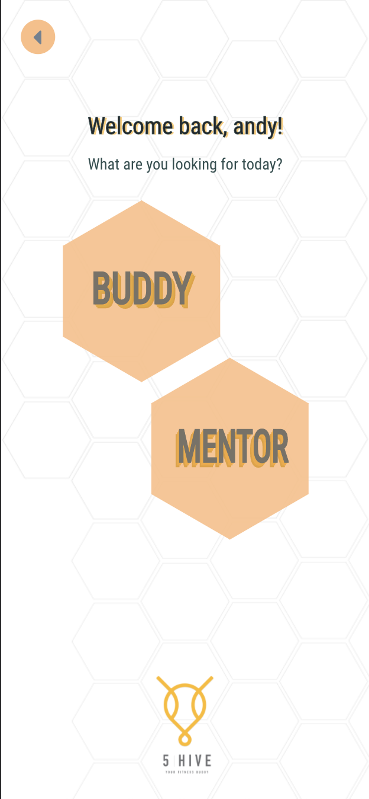
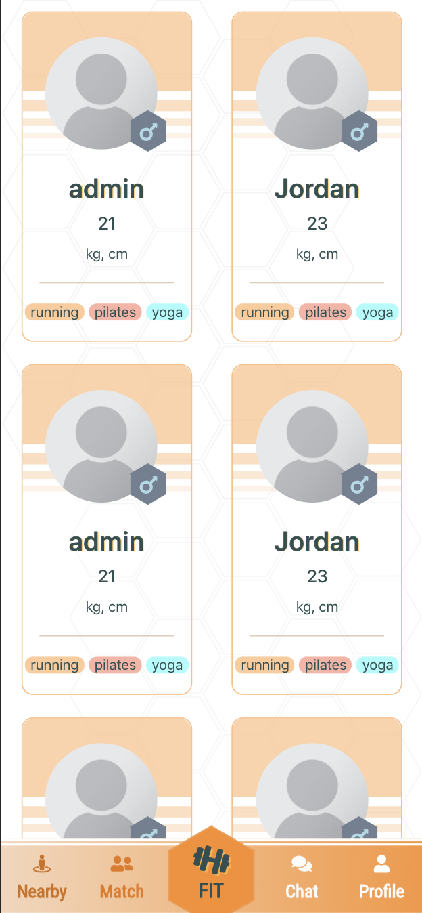
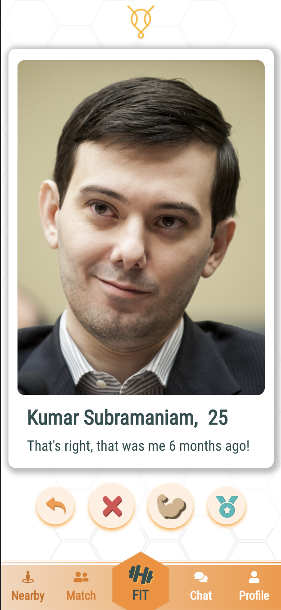
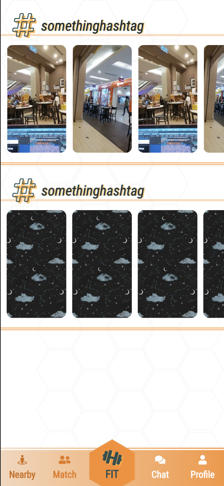
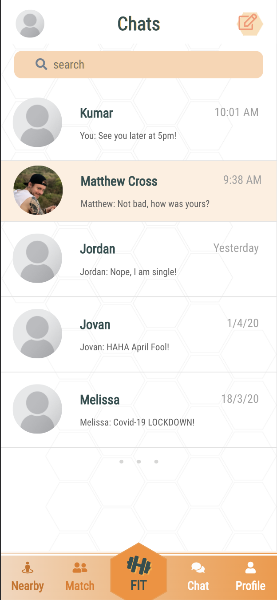

## How the app looks

  
  
  
  
  
  
  
  
  

## Remember to `npm install` right after you pull from master EVERY TIME to install the package(s) someone else did, if there is any.

# Things to note for our Group Project

1. Use `git pull` to pull the latest updates or `git clone` from master branch for the first time.
2. If you are assigned to the specific feature, use `git checkout -b feat/<FILENAME>` and work on the branch separtely.
3. You can always check which branch you are current at by typing `git branch`. It's fine to commit and push to your own branch but remember, NEVER push to the MASTER branch ! 
4. Use `git push origin feat/<FILENAME>` to push to your own branch.
5. Jovan will perform the pull and merge request, git rebase etc.

**************************************************************
